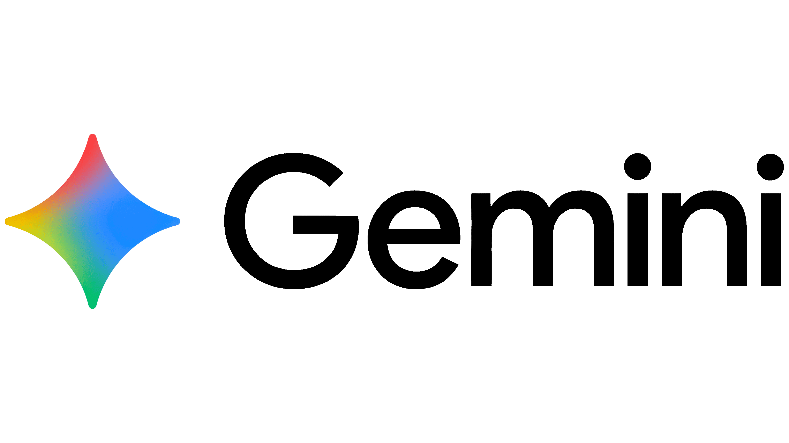

# Engelbart Canvas

A keyboard-less and mouse-less multiplayer whiteboard that uses webcam gestures and voice control for a fully hands-free collaborative drawing experience.

<div align="center">
  
  &nbsp;&nbsp;&nbsp;&nbsp;
  
  &nbsp;&nbsp;&nbsp;&nbsp;
  
  &nbsp;&nbsp;&nbsp;&nbsp;
  
</div>

<br/>

## What I Built

**Engelbart Canvas** is a real-time collaborative whiteboard that reimagines how we interact with digital canvases. Instead of using a keyboard and mouse, users control the canvas entirely through:

- **Hand Gestures** (via webcam): Draw, erase, and select areas using natural hand movements detected by your webcam
- **Voice Commands**: Change pen colors, adjust brush sizes, and generate AI images using conversational voice control
- **AI Image Generation**: Select any area on the canvas and generate abstract artwork that seamlessly integrates into your drawing

### Key Features

1. **Real-time Multiplayer**: Multiple users can join a room and see each other's cursors, drawings, and gestures in real-time
2. **Gesture Controls**:
   - ☝️ **Pointing Up**: Activates pen tool and draws
   - ✋ **Open Palm**: Activates eraser tool
   - ✌️ **Victory**: Creates a selection area for AI generation
   - 👍 **Thumbs Up**: Activates voice assistant
   - 👎 **Thumbs Down**: Deactivates voice assistant
3. **Voice Assistant**: Natural language control for:
   - Changing pen colors ("make the pen blue")
   - Adjusting brush size ("make the brush thicker")
   - Generating images in selected areas ("create an abstract painting here")
4. **Smart Cursors**: Each user's cursor dynamically shows:
   - Their username and current gesture emoji
   - Triangle cursor (colored by current pen color)
   - Circle cursor (white, when eraser is active)
5. **Freehand Drawing**: Smooth, real-time drawing with adjustable brush sizes and colors
6. **AI Image Generation**: Select any canvas area and generate artwork using Fal.ai's image-to-image model

## Technologies Used

### Core Stack

- **Next.js 14** (App Router) - React framework for the web application
- **TypeScript** - Type-safe development
- **Tailwind CSS** - Utility-first styling

### Real-time Collaboration

- **Supabase Realtime** - WebSocket-based real-time presence and broadcasts
  - Presence API for multi-cursor tracking
  - Broadcasts for drawing strokes, gestures, and tool changes
- **Supabase Storage** - Image hosting for AI-generated artwork

### AI & ML Services

- **Google MediaPipe** (`@mediapipe/tasks-vision`) - Hand gesture recognition
  - HandLandmarker for fingertip tracking
  - GestureRecognizer for detecting 9+ hand gestures
- **ElevenLabs Conversational AI** (`@elevenlabs/client`) - Voice assistant with custom client tools
  - **Tool Calling**: Custom client tools that execute in the browser
  - `change_pen_color` - Parses natural language color names and updates pen color
  - `change_brush_size` - Adjusts brush thickness based on voice commands
  - `generate_image` - Triggers AI image generation with user-provided prompts
- **Fal.ai** (`@fal-ai/client`) - Fast AI image generation
  - Model: `fal-ai/nano-banana/edit` for image-to-image generation

### Graphics & Rendering

- **HTML Canvas API** - High-performance 2D drawing with:
  - Real-time stroke rendering
  - Compositing operations for eraser functionality
  - DPR-aware scaling for crisp visuals

## How It Works

1. **Create a Room**: Users create a shareable room with a unique URL
2. **Join with Avatar**: Select an avatar and name to enter the room
3. **Enable Magic Mode**: Activate hand gesture and voice control
4. **Draw & Collaborate**:
   - Use hand gestures to draw and erase
   - Voice commands to customize colors and brush size
   - Select areas with the Victory gesture to generate AI artwork
5. **Real-time Sync**: All actions are broadcast to other users in the room via Supabase Realtime

## Getting Started

1. Clone the repository
2. Install dependencies:
   ```bash
   npm install
   ```
3. Set up environment variables in `.env.local`:
   ```
   NEXT_PUBLIC_SUPABASE_URL=your_supabase_url
   NEXT_PUBLIC_SUPABASE_ANON_KEY=your_supabase_anon_key
   SUPABASE_SERVICE_ROLE_KEY=your_service_role_key
   FAL_KEY=your_fal_api_key
   ELEVENLABS_API_KEY=your_elevenlabs_api_key
   ELEVENLABS_AGENT_ID=your_elevenlabs_agent_id
   ```
4. Run the development server:
   ```bash
   npm run dev
   ```
5. Open [http://localhost:3000](http://localhost:3000)

## Technical Highlights

- **Optimized Real-time Performance**: Throttled cursor movements and debounced gesture detection for smooth 60fps rendering
- **DPR-Aware Canvas**: High-resolution rendering that adapts to device pixel ratios
- **Streaming Strokes**: In-progress drawing strokes are streamed to peers in real-time, not just on completion
- **Client-Side MediaPipe**: Webcam processing happens entirely in the browser for privacy and low latency
- **Voice Tool Integration**: ElevenLabs client tools with custom handlers for pen color, brush size, and AI generation
- **Mirrored Fingertip Coordinates**: Natural left/right movement with front-facing cameras

## Demo

Try it live or watch the demo video to see gesture-controlled collaborative drawing in action!

---

Built with ❤️ using Supabase, ElevenLabs, Fal.ai, and Google Gemini
